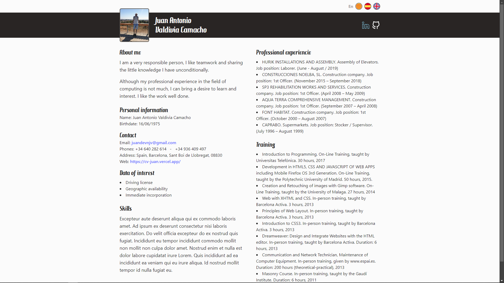

# CV Juan A. Valdivia Camacho

## Tecnologías usadas

- React
- Vite
- Tailwind
- i18next
- i18next-browser-languagedetector
- i18next-http-backend
- react-i18next
- file-saver

## Proyectos destacados del CV

- El CV incluye una sección visual para proyectos desplegados
- Actualmente muestra `Facturas Sayju` y `Horas Adicionales`
- Los textos se gestionan desde:
  - `public/locales/es/translation.json`
  - `public/locales/en/translation.json`
  - `public/locales/ca/translation.json`
- Las capturas usadas por el CV están en:
  - `public/images/jpg/facturasSAYJU.png`
  - `public/images/jpg/HorasAdicionales.png`
- El render de estos bloques se compone en:
  - `src/App.jsx`
  - `src/components/ProjectEntry.jsx`
